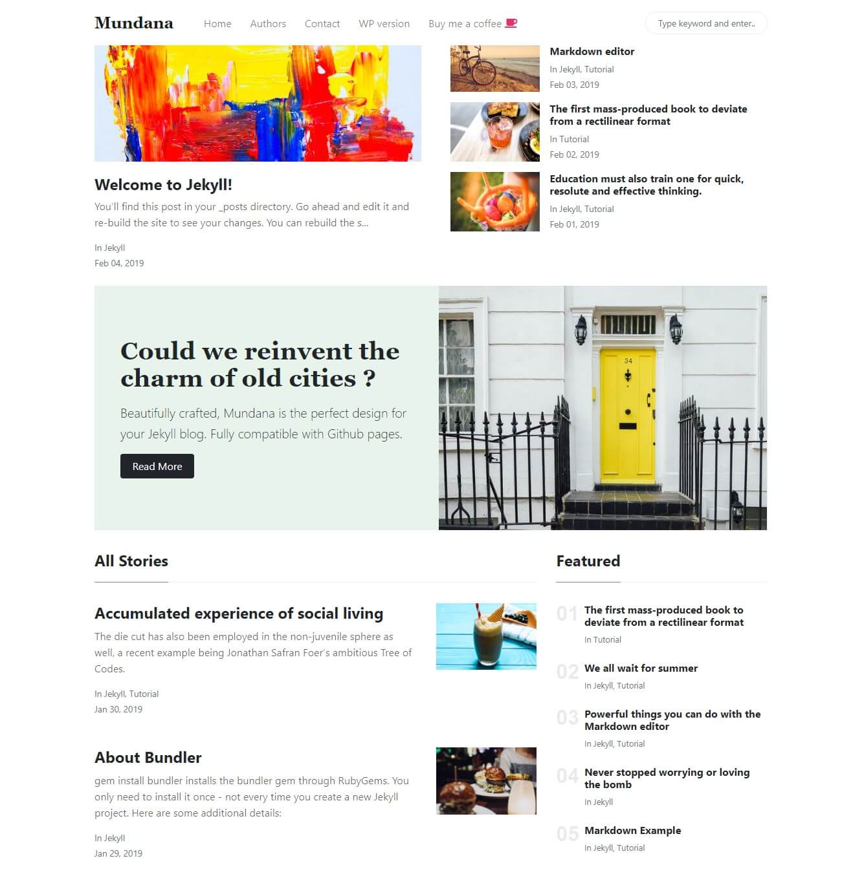

# Jekyll Theme - Mundana by WowThemes.net

[Live Demo](https://wowthemesnet.github.io/mundana-theme-jekyll/) &nbsp; | &nbsp; 
[Download](https://github.com/wowthemesnet/mundana-theme-jekyll/archive/master.zip) &nbsp; | &nbsp; 
[Buy me a coffe](https://www.wowthemes.net/donate/) &nbsp; | &nbsp; [Documentation](https://bootstrapstarter.com/bootstrap-templates/mundana-theme-jekyll/) &nbsp; | &nbsp; 
[WordPress version](https://www.wowthemes.net/themes/mundana-wordpress/) 

### Documentation

understanding "pace and priorities" of differing types of people and how to reach out while they're under stress. It also pr

personality types are: Driver, Expressive, Amiable, and Analytical. There are two variables to identify any personality: Are they better at facts & data or relationships? And are they introverted or extroverted.

    Driver — Fact-Based Extrovert
    Analytical — Fact-Based Introvert
    Amiable — Relationship Introvert
    Expressive — Relationship Extrovert

Note: Mos

My User Manual is one of the ways I practice leading out loud. It’s a living document that describes my innate wiring and my growing edge, while putting it out to the world that I know I am – and aim to always be -- a work-in-progress.

I sat with questions like: 

Which activities give me energy

Which deplete me?

What are my unique abilities (my superpowers)

How do I maximize the time I spend expressing them? 

What do people misunderstand about me, and why?

Abby’s User Manual

My style 

    I’ve been hard-wired as an entrepreneur since I was a kid.  
    I hover in ambiguity and possibility, and am most energized when I’m connecting dots/people/resources that translate challenges into opportunities. I am always scanning for information to feed ideas in my mind, and typically do my best thinking out loud.
    My high expectations are matched by my commitment to support people in meeting them. I believe in giving people freedom, flexibility and “stretch” assignments, and equipping them with the tools they need to uncover and develop their potential. 
    I’m determined to prevent my attention from being hijacked by technology. I never open my computer until I’ve written my quick list of what I intend to do; I hide my inbox to help me focus, and I’ve tried to take control of my phone by removing everything that’s not a “tool” from my home screen. 

What I value 

    I value resourcefulness and proactivity.  Be smart, move fast and pivot quickly. Ask forgiveness rather than permission. 
    I’m obsessed with efficiency: I touch each email only once (respond, delete, delegate, or delay), and live by the law of 80/20 – often prioritizing promptness (ie. 24-hour rule in following up on a meeting) over perfection. I start each day by “eating my frog” when my energy and attention are fresh.
    I expect my teammates to value efficiency as well. Before doing something “the way it’s always been done,” scan for an easier, cheaper, simpler way to maximize your “return on effort”. Before starting something from scratch, ask if it’s already been tried.  
    I value scrappiness and feel an obligation to our staff, Fellows, partners and donors to focus our limited time and resources on the “real good” vs. the “feel good”. 
    I believe work-life alignment matters more than work-life balance, and that strategic self-care – whether sleeping enough, leaving work early to exercise, meditate, or spend time in nature – is the key ingredient to becoming our best, most productive and happy selves. I am religious about spending time unplugged – a day a week, and a few weeks a year. 

What I don’t have patience for

    If you make a mistake or something is heading off the rails, tell me before the crash. Failure is great (as long as you learn quickly); surprises are not. 
    I get antsy with hypothetical musings and over-analysis. I learn best through experience and experimentation and have a strong bias toward action. 
    I default to trust, but if my confidence is shaken, it’s hard to rebuild. Ways to lose my trust: not following through, withholding important information, avoiding hard conversations, or treating others with disrespect.
    I am turned off by entitlement, boredom and taking things for granted – it’s a privilege to do what we do, and it’s our joyful responsibility to take our work seriously, but not ourselves!

How best to communicate with me 

    Be crisp.  Start with the headlines. I prefer bullet points to prose, and .PPT to .DOC.
    I love to solve problems, remove barriers and help others move the ball forward.  Come to me not just with problems, but with plausible solutions and your recommended course of action. 
    I value authenticity, honesty and transparency. If I say something you disagree with, tell me. I am hungry to be challenged in thoughtful and constructive ways. I respect people who have the right blend of confidence and humility to know when to question someone (even the boss!), and when to defer to another's expertise. 

How to help me

    I move quickly and don’t always catch every detail (except when it comes to our brand and communications where I’m a painstaking perfectionist).  I appreciate help making sure the details are covered, and flagging for me any that need my attention. 
    Nudge me when it’s time to start or end a meeting - but have (some) patience with my flexible approach to time.
    Tell me what I need to know, not what you think I want to hear. 

What people misunderstand about me

    I am an introvert, posing as a professional extrovert.  Don’t confuse my tendency to work alone in my office with being disengaged.  My door’s always open. 
    I speak with conviction, but I’m not set in my thinking. I'm open-minded and always delighted to be shown a better way.  I make decisions quickly, but if you give me reasoning or data that points in another direction, I’ll happily change course. 

Finally, I may be the boss, but I’m also a person, a teammate and a messy work-in-progress. I’m committed to always getting better at my job, and to becoming a wiser, kinder and more impactful human. 

---

0 notifications total

Skip to main content
LinkedIn

    33

Home
My Network
Jobs
Messaging
Notifications

    Dug Falby

    Restart Premium Free Trial

Five Steps to Create a Personal User Manual

    Published on January 29, 2013

Aaron Hurst
Aaron Hurst Influencer
Founder, Taproot Foundation & Imperative (Hiring!)
206 articles

Yesterday I shared the concept of a personal user manual and many of you wrote that you loved the idea but needed ideas for how to actually create your manual. It does require a good deal of self-awareness as well as diplomacy in how you frame your challenges in a vulnerable but strong voice.

Here are five steps that will help you create a manual and have your team embrace it.

Step One: Rough Cut
Take no more than an hour and just answer these questions with the first thing that comes to mind.

- What is your style?

- When do you like people to approach you and how?

- What do you value?

- How do you like people to communicate with you?

- How do you make decisions?

- How can people help you?

- What will you not tolerate in others?

Step Two: First Draft
You have a really rough draft now. It is time to add some depth and round it out. Before you start to workshop it with your colleagues, use some other tools to help you refine your manual. Look for clues in assessments you have done in the past. Myers Briggs? Strength Finder? Also re-read your performance reviews from the last few years for clues.

Step Three: Input & Workshop
Send an email to your colleagues asking them to answer the questions in step one about you. What is their impression? Ideally, have the team all doing this at the same time and rather than do this over email, do it together around a table. Share your draft and ask them for feedback on what they find accurate, off or just not clear.

## Step Four: Finalize

Based on the inputs from your colleagues, make a final edit. You are done – for now.

## Step Five: Revise

Once a year, dust your manual off and see if it still feels accurate to you and your colleagues. Any new insights?

